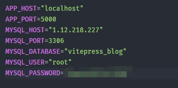
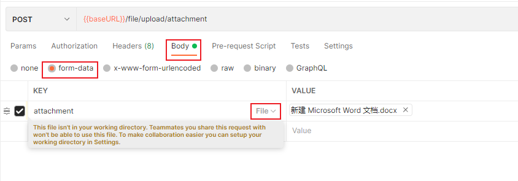

# 一、项目介绍

这个项目是[vitepress-blog](https://github.com/cyan0714/vitepress-blog)个人博客和知识库的后台项目，使用非常优秀的 Node.js Koa2 框架做服务端 API 接口。该项目仅供学习使用。

- [点击这里预览 vitepress-blog](http://1.12.218.227)

vitepress-blog 首页


## 1.1.项目模块

- 英雄语录模块
  - 记录了英雄联盟中各个英雄的经典台词以及论语、道德经等名言
- 文件管理模块
  - 图片、文件的上传
  - 图片、文件的下载
- 持续更新...

## 1.2.技术栈
- koa2
- koa-bodyparser
- koa-multer
- koa-router
- mysql2
- dotenv

# 二、使用项目

## 2.1.项目架构

```iterm2
├── imgs 项目中用到的图片
├── src *重点, 项目工程入口
    ├── app
        ├── config 配置相关
        ├── database.js 数据库相关
        ├── index.js 入口文件
    ├── constants 常量
        ├── file-path.js 图片和文件存储的路径
    ├── controller 控制器
        ├── file.controller.js
        ├── quotes.controller.js
    ├── middleware 中间件
        ├── file.middleware.js
    ├── router 路由
        ├── file.router.js
        ├── quotes.router.js
        ├── index.js
   ├── service 操作数据库的地方
        ├── file.service.js
        ├── quotes.service.js
   ├── main.js 入口文件
├── .env 配置文件(这个要自己加)
├── .gitignore
├── package-lock.json
├── package.json
└── README.md
```

## 2.2.准备

```
git clone https://github.com/cyan0714/koa-vitepress-blog-server.git
```
```
cd koa-vitepress-blog-server
npm install 或者 yarn install
```

## 2.3.创建数据库

启动项目前一定要在创建好 `vitepress_blog` 数据库！！！

在项目根目录下添加 .env 文件, 然后配置以下内容:



其中, 你需要更换`MYSQL_HOST`和`MYSQL_PASSWORD`为你本地或云服务器的地址


```
# 登录数据库

mysql -uroot -p (回车然后输入你的本机数据库密码)

# 导入 sql 文件

```

## 2.4.启动项目
```
npm start 或者 yarn start
```

## 2.5.接口文档

### 随机获取 3 条语录

```
GET    /quotes/one-quote
```

#### 成功操作返回

```json
[
  {
    "id": 76,
    "hero": "卡密尔",
    "word": "自负，会让每个人都屈膝下跪。"
  },
  {
    "id": 123,
    "hero": "易",
    "word": "我的剑就是你的剑!"
  },
  {
    "id": 177,
    "hero": "论语",
    "word": "不愤不启，不悱不发，举一隅而不以三隅反，则不复也。"
  }
]
```

### 获取某个英雄的语录

```
GET    /quotes/all-quote
```

#### 参数说明

| 参数 | 说明   | 是否必填 |
| ---- | ------ | :------: |
| hero | 英雄名 |    是    |

#### 成功操作返回

```json
[
  {
    "id": 69,
    "hero": "卡密尔",
    "word": "不要有趣，要有用。"
  },
  {
    "id": 70,
    "hero": "卡密尔",
    "word": "自立自主，总胜过俯首为奴。"
  },
  ...
  {
    "id": 144,
    "hero": "卡密尔",
    "word": "如果生活还没能改变你, 你就已经失败了。"
  }
]
```

### 上传图片

```
POST    /file/upload/picture
```

#### 参数说明

| 参数    | 说明                            | 是否必填 |
| ------- | ------------------------------- | :------: |
| picture | 固定, content-type 为 form-data |    是    |
| type    | 英雄名                          |    是    |

如:

将图片中的 attachment 改为 picture 即可

#### 成功操作返回

```json
图片上传成功~
```

### 上传附件

```
POST    /file/upload/attchment
```

#### 参数说明

| 参数      | 说明                            | 是否必填 |
| --------- | ------------------------------- | :------: |
| attchment | 固定, content-type 为 form-data |    是    |
| type      | 英雄名                          |    是    |

如:


#### 成功操作返回

```json
文件上传成功~
```

### 下载(获取)图片

```
GET    /file/picture
```

#### 参数说明

| 参数     | 说明   | 是否必填 |
| -------- | ------ | :------: |
| filename | 文件名 |    是    |

#### 成功操作返回

```json
blob 对象
```

### 下载(获取)附件

```
GET    /file/attachment
```

#### 参数说明

| 参数     | 说明   | 是否必填 |
| -------- | ------ | :------: |
| filename | 文件名 |    是    |

#### 成功操作返回

```json
blob 对象
```

### 获取图片路径列表

```
GET    /file/pictures
```

#### 参数说明

| 参数 | 说明   | 是否必填 |
| ---- | ------ | :------: |
| type | 英雄名 |    是    |

#### 成功操作返回

```json
[
  {
    "path": "1.12.218.227:8080/file/picture/37567791086892149baa7c0c581a80a5"
  },
  ...
]
```
